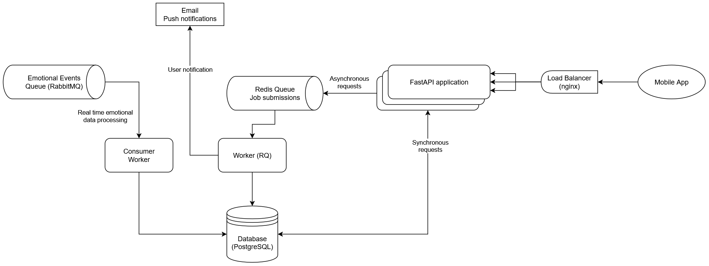

# Empathic Credit System (ECS)

## Project Overview

The Empathic Credit System is a revolutionary financial platform that leverages emotional data from users to offer personalized credit solutions. By analyzing emotional patterns alongside traditional financial data, ECS provides more empathic and tailored credit offers to customers.

This system was built as part of CloudWalk's technical challenge to demonstrate integration of emotional data analytics with financial services in a secure, scalable architecture.

## System Architecture



The ECS architecture is designed around the following components:

1. **Client-facing API Layer**: Multiple FastAPI instances behind an Nginx load balancer, providing REST endpoints for credit applications and user interactions.

2. **Authentication**: JWT-based authentication system supporting both user credentials and client credentials flows.

3. **API endpoints | Data ingestion pipeline**:
   - **Synchronous Processing**: Direct database operations for immediate user responses
   - **Asynchronous Processing**: Redis Queue (RQ) for background job processing like credit offer acceptance
   - **Real-time Emotional Data**: RabbitMQ for streaming emotional events from client devices

4. **Workers**:
   - **RQ Worker**: Processes background jobs like credit approval finalization and notifications
   - **Consumer Worker**: Processes emotional events from RabbitMQ

5. **Database**: PostgreSQL for structured data storage, including user profiles, transactions, credit accounts, and emotional events

## Data Model

The ECS data model centers around these core entities:

### User Profiles
- **Users**: Core user information
- **Clients**: API client credentials for server-to-server communication

### Financial Data
- **Transactions**: User financial transaction history
- **Credit Accounts**: Active credit accounts for users
- **Credit Offers**: Credit offers generated for users

### Credit Analysis
- **Risk Assessments**: Credit risk evaluations including ML model outputs

### Emotional Data
- **Emotional Events**: Captured emotional data from users containing:
  - Primary emotion (happiness, sadness, fear, anger, surprise, disgust)
  - Emotion confidence score
  - Dimensional representation (arousal/valence)

## API Endpoints

### Authentication
```
POST /token
```
- Supports two flows:
  - **User Authentication**: `grant_type=password` with `username` and `password`
  - **Client Authentication**: `grant_type=client_credentials` with `client_id` and `client_secret`
- Returns a JWT token for API access

### Credit Application
```
POST /api/v1/credit/apply
```
- Requires user authentication
- Analyzes user's financial history and emotional data
- Integrates with ML model for risk assessment
- Returns a credit offer with limit, interest rate, and credit type

### Credit Offer Acceptance
```
POST /api/v1/credit/offers/{offer_id}/accept
```
- Requires user authentication
- Asynchronously processes accepted credit offers
- Creates a credit account and notifies the user
- Returns a 202 Accepted response with job tracking information

### Emotional Data Ingestion
```
POST /api/v1/emotions/ingest
```
- Requires client authentication
- Accepts emotional events data from client devices
- Alternatively, emotional data can be streamed through RabbitMQ via the Consumer Worker

## Technology Stack

- **API Framework**: Asynchronous FastAPI with Uvicorn
- **Load Balancer**: Nginx with least connections algorithm
- **Database**: PostgreSQL for relational data storage
- **Background Processing**: Redis Queue (RQ) for asynchronous tasks
- **Message Streaming**: RabbitMQ for real-time emotional data
- **Authentication**: JWT-based with password hashing
- **Containerization**: Docker and docker-compose for service orchestration
- **Logging**: Structured logging with structlog

## Environment Setup

> [See .env.example](./.env.example)

The system can be configured through environment variables, typically stored in a `.env` file:

```
# Environment settings
ENVIRONMENT=development        # development or production
DEBUG=true                     # Enable debug mode

# Deployment settings
APP_PORT=8000                  # API port (used in dev; prod uses nginx)

# Logging config
LOG_LEVEL=debug                # debug, info, warning, error

# Database configuration
DB_URL=                        # PostgreSQL database URL
POSTGRES_USER=                 # PostgreSQL database user
POSTGRES_PASSWORD=             # PostgreSQL database password
POSTGRES_DB=                   # PostgreSQL database name

# Redis configuration
REDIS_URL=                     # Redis URL for RQ

# RabbitMQ configuration
RABBITMQ_USER=                 # RabbitMQ username
RABBITMQ_PASS=                 # RabbitMQ password
RABBITMQ_HOST=                 # RabbitMQ host
RABBITMQ_PORT=                 # RabbitMQ port

# Authentication
JWT_SECRET=                    # Secret key for JWT signing
JWT_EXPIRES_SECONDS=           # Token expiration time in seconds
JWT_ALGORITHM=                 # JWT algorithm

# Feature engineering configuration
FEATURE_ENGINEERING_TRANSACTIONS_LAST_DAYS=30       # Days of transaction history to analyze
FEATURE_ENGINEERING_TRANSACTIONS_LIMIT=1000         # Max transactions to process
FEATURE_ENGINEERING_EMOTIONAL_EVENTS_PERIOD_DAYS=7  # Days of emotional data to analyze
FEATURE_ENGINEERING_EMOTIONAL_EVENTS_LIMIT=50       # Max emotional events to process
```

## Development and Deployment


### Makefile
Run `make help` to see all available commands:

```bash
Available commands:
  make migrate-generate DB_URL=<your DB URL> MIGRATION_NAME='description' - Generate a new migration from model changes
  make migrate-upgrade DB_URL=<your DB URL>                               - Apply all pending migrations
  make migrate-downgrade DB_URL=<your DB URL>                             - Rollback one migration
  make migrate-current DB_URL=<your DB URL>                               - Show current migration version
  make migrate-history DB_URL=<your DB URL>                               - Show migration history
  make db-up                                                              - Start database services; run migrations manually
  make db-down                                                            - Stop database services
  make seed-dev DB_URL=<your DB URL>                                      - Seed database with test data
  make run-dev                                                            - Run application
  make down-dev                                                           - Shutdown application
  make run-prod                                                           - Run application
  make down-prod                                                          - Shutdown application
  make clean-dev DB_URL=<your DB URL>                                     - Clean dev data
  make produce-emotions                                                   - Run emotional events producer script
```

### Local Development
```bash
# Set up environment
cp .env.example .env
# Edit .env with your configuration

# Start development services
make run-dev

# Seed development database with test data
make seed-dev

# Run emotional event producer for inserting more emotional data for all users
make produce-emotions

# Stop all services
make down-dev
```

### Production Deployment
```bash
# Start production environment with load balancing
make run-prod

# Stop all services
make down-prod
```

### Migration management:

```
make migrate-generate DB_URL=<your DB URL> MIGRATION_NAME='description' - Generate a new migration from model changes
make migrate-upgrade DB_URL=<your DB URL>                               - Apply all pending migrations
make migrate-downgrade DB_URL=<your DB URL>                             - Rollback one migration
make migrate-current DB_URL=<your DB URL>                               - Show current migration version
make migrate-history DB_URL=<your DB URL>                               - Show migration history
```


## Error Handling Strategy

ECS implements a comprehensive error handling system with the following features:

1. **Layered Exception Handling**:
   - **Repository Layer**: Database-specific errors: `DatabaseError`, `NotFoundError` ([All Exceptions](./ecs/repositories/exceptions.py))
   - **Service Layer**: Business logic errors: `BusinessLogicError` ([All Exceptions](./ecs/services/exceptions.py))
   - **API Layer**: Request handling errors: `BadRequestError` ([All Exceptions](./ecs/api/exceptions.py))

2. **Environment-Aware Responses**:
   - Development: Rich error details with context and stack traces
   - Production: Sanitized responses without internal details

3. **Structured Error Format**:
   - Consistent JSON error responses with error codes and messages
   - Additional context included in development mode

4. **Request Tracing**:
   - X-Request-ID header for request tracking
   - Context propagation through structlog for unified logging


## Logging and Observability

ECS uses structured logging throughout the stack to ensure traceability, debuggability, and operational insight. All HTTP requests are automatically logged with rich context using a custom FastAPI middleware.

### Request Logging Middleware

The logging middleware is implemented in [`ecs/api/middleware.py`](./ecs/api/middleware.py) and is enabled for all incoming HTTP requests. It provides:

- **Request ID propagation**: Each request is assigned a unique `X-Request-ID` (or uses the incoming one), which is included in all logs and response headers.
- **Structured logs**: All logs are output in structured JSON format using structlog, making them easy to parse and search in log aggregation systems.
- **Contextual information**: Logs include method, path, user agent, client IP, status code, and request duration.
- **Exception logging**: Unhandled exceptions are logged with stack traces and request context.

## Business Logic Decisions

### Credit Offer Calculation: [CreditOfferCalculator](./ecs/services/credit_service.py)
- **Risk Categories**: Very Low, Low, Medium, High
- **Immediate Rejection**: High Risk category results in rejection
- **Base Limit Calculation**: Exponential decay against risk score
- **Multipliers**:
  - Average daily spend
  - Transaction frequency
  - Emotional trend analysis
  - Risk score weighting
- **Interest Rate**: 8-25% APR based on risk score
- **Credit Types**:
  - Short-term for High/Medium risk
  - Long-term for Low/Very Low risk

### User Constraints
- Users can have only one active credit offer
- Users can have only one active credit account
- Credit offers expire if not accepted within a configured timeframe

### Asynchronous Processing
- Credit acceptance uses background processing to avoid blocking API responses
- All business rules are validated both at submission and processing time to prevent race conditions

## Setup Instructions

### Prerequisites
- Docker and docker-compose
- Make (optional, for convenience commands)

### Quick Start
1. Clone the repository
2. Copy `.env.example` to `.env` and configure variables
3. Run `make run-prod` for production or `make run-dev` for development
4. Access the API at `http://localhost:80` (production) or `http://localhost:8000` (development, follows APP_PORT environment variable)


## Testing

See [the testing documentation](./tests)